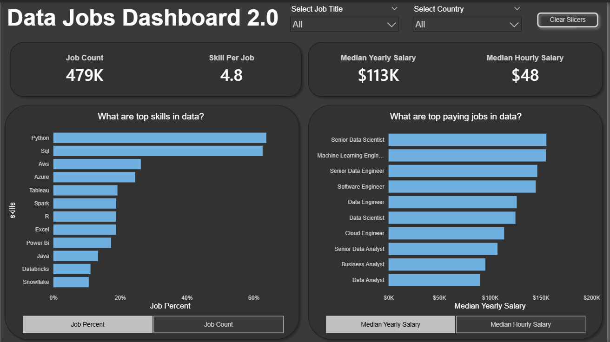
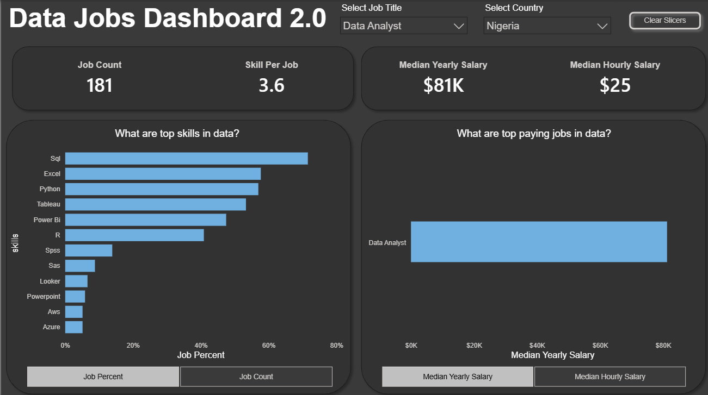
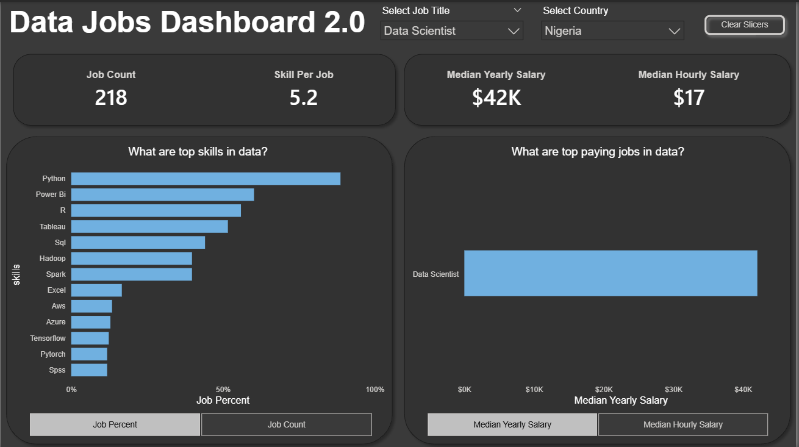

# Data Skills & Salary Analysis Dashboard



## Overview

An advanced Power BI dashboard that analyzes the relationship between technical skills and compensation in the data industry. Built using relational data modeling with multiple connected tables to provide deeper insights into what skills drive higher salaries and which combinations are most valuable.

## Problem Statement

Job seekers often wonder: "Which skills should I learn to maximize my earning potential?" This dashboard answers that question by analyzing real market data to show which technical skills correlate with higher compensation and how skills are combined in actual job postings.

## Data Source

- **Dataset:** 2024 Data Science Job Postings from [Luke Barousse's Data Jobs Database](https://lukebarousse.com/data)
- **Structure:** Relational database with 4 tables
  - `job_postings_fact` - Main job postings data
  - `skills_dim` - Skills dimension table
  - `skill_job_dim` - Bridge table linking jobs to skills
  - `company_dim` - Company information
- **Records:** 479,000+ job postings
- **Time Period:** January - December 2024

## Skills Showcased

### Advanced Data Modeling
- **Table Relationships:** Merged multiple fact and dimension tables using Power Query
- **Data Transformation:** 
  - Cleaned text fields (removed prefixes, standardized capitalization)
  - Created custom columns using "Column from Examples"
  - Changed data types for optimization
  - Handled missing values and duplicates
- **Query Merging:** Combined `job_postings_fact` → `skill_job_dim` → `skills_dim` to create analytical dataset

### Advanced DAX
- **Dynamic Calculations:** Created measures using DIVIDE and ALLSELECTED functions
- **Field Parameters:** Built switchable metrics for flexible analysis
- **Numeric Parameters:** Enabled users to toggle between different salary views
- **Context Manipulation:** Used CALCULATE and filter context to generate accurate percentages

### Interactive Design
- **Slicers:** Multi-select filters for job titles and countries
- **Field Parameters:** Toggle between Job Count and Job Percent views
- **Dynamic Visuals:** Charts update based on user selections
- **Clear Filters Button:** Reset all selections with one click

## Dashboard Features

### KPI Cards
- **Job Count:** Total postings analyzed (479K)
- **Skills Per Job:** Average number of skills required per posting (4.8)
- **Median Salaries:** Yearly ($113K) and Hourly ($48)

### Main Visualizations

**1. Top Skills in Data** (Stacked Bar Chart)
- X-axis: Switchable between Job Count and Job Percent (field parameter)
- Y-axis: Technical skills
- Shows Python and SQL dominating at 60%+ of postings

**2. Top Paying Jobs in Data** (Stacked Bar Chart)
- X-axis: Switchable between Median Yearly and Hourly Salary (field parameter)
- Y-axis: Job titles
- Machine Learning Engineers lead at $61/hour

### Interactive Elements
- **Job Title Slicer:** Filter by specific role (Data Analyst, Data Scientist, etc.)
- **Country Slicer:** Filter by geographic location
- **Clear Slicers Button:** Reset all filters instantly

## Technical Implementation

### Power Query Transformations
```
1. Merged job_postings_fact with skill_job_dim on job_id
2. Merged result with skills_dim on skill_id
3. Text cleaning:
   - Removed "via " prefix from job_via column
   - Capitalized first letter of each posting source
   - Standardized text formatting
4. Created calculated columns for analysis
```

### Key DAX Measures Created

**Core Metrics:**
```dax
Job Count = COUNTROWS(job_postings_fact)

Skill Count = COUNTROWS(skill_job_dim)

Skills Per Job = 
DIVIDE(
    [Skill Count],
    [Job Count]
)

Median Yearly Salary = MEDIAN(job_postings_fact[salary_year_avg])

Median Hourly Salary = MEDIAN(job_postings_fact[salary_hour_avg])
```

**Advanced Calculations:**
```dax
Job Percent = 
DIVIDE(
    [Job Count],
    CALCULATE(
        [Job Count],
        ALLSELECTED(skills_dim)
    )
)

Grand Total Skill Count = 
CALCULATE(
    [Skill Count],
    ALL(skills_dim)
)
```

**Additional Measures for Context:**
- `Median Yearly Salary (US)` - US-specific salary filtering
- `Median Yearly Take-Home Pay` - Net salary calculations
- `Column` - Custom aggregation measure

These measures work together to provide dynamic calculations that respond to slicer selections while maintaining accurate context for percentage and total calculations.

### Field Parameters Created
1. **Salary Type Parameter:** Toggle between Yearly/Hourly salary views
2. **Count vs Percent Parameter:** Switch between absolute counts and percentages

## Key Insights

1. **Skills Hierarchy:**
   - **Tier 1 (Essential):** Python (60%), SQL (58%)
   - **Tier 2 (Valuable):** AWS, Azure, Tableau (15-20%)
   - **Tier 3 (Specialized):** Spark, R, Java (10-15%)

2. **Skill Density:** Average data job requires 4.8 different technical skills - specialization alone isn't enough

3. **Highest Paying Roles:**
   - Machine Learning Engineer: $61/hour
   - Software Engineer: $60/hour
   - Data Engineer: $59/hour
   - Data Analyst: $33/hour (entry point)

4. **Skill-Salary Correlation:** 
   - Python + SQL combination appears in 70% of six-figure roles
   - Cloud skills (AWS, Azure) increase median salary by ~15%
   - BI tools (Power BI, Tableau) are table stakes but don't significantly increase pay alone

5. **Market Reality:** Excel and Power BI each appear in 20%+ of postings despite being considered "basic" - fundamentals still matter

## Nigeria Market Insights

By filtering the dashboard to Nigerian opportunities, I uncovered interesting regional differences:

**Data Analyst in Nigeria:**
- **181 positions** available (smaller but growing market)
- **$81K median salary** (competitive with global entry-level roles)
- **Top skills required:** SQL > Excel > Python > Tableau > Power BI
- **Skills per job:** 3.6 (lower than global average of 4.8)
- **Key takeaway:** Nigerian analyst roles prioritize SQL fundamentals and Excel proficiency

**Data Scientist in Nigeria:**
- **218 positions** available (slightly more than analyst roles)
- **$42K median salary** (lower than global average, but reflects local market)
- **Top skills required:** Python > Power BI > R > Tableau > SQL
- **Skills per job:** 5.2 (higher than analyst roles, matching global trends)
- **Key takeaway:** Data Scientist roles in Nigeria demand more diverse technical skills

**Market Reality Check:**
The Nigerian data market offers genuine opportunities but at salary levels reflecting the local economy. For Nigerian professionals, remote work with international companies offers the potential to earn closer to global rates ($90K-$113K) while living locally.

This analysis informed my decision to target **remote international opportunities** while building locally relevant skills.

## Dashboard Screenshots

### Main View - Global Market Overview

*Showing all data roles across all countries - Python and SQL dominate at 60%+ of postings*

### Filtered View - Data Analyst Roles in Nigeria

*181 Data Analyst positions in Nigeria with $81K median salary - SQL is #1 required skill*

### Filtered View - Data Scientist Roles in Nigeria

*218 Data Scientist positions in Nigeria with $42K median salary - Python leads with 5.2 skills required per job*

## What I Learned

### Technical Growth
- How to properly model relational databases in Power BI
- Advanced DAX functions beyond basic aggregations
- Power Query transformations for complex data cleaning
- Creating dynamic, user-controlled parameters

### Analytical Thinking
- How to ask better questions of interconnected data
- The importance of data relationships in accurate analysis
- How to balance technical depth with user-friendly design
- Understanding global vs local market dynamics

### Career Insights
- Which skills to prioritize in my learning journey (Python + SQL first)
- Realistic salary expectations for different role levels and regions
- The importance of skill combinations over single tools
- Strategic value of targeting remote international roles from Nigeria

## Comparison to Dashboard 1.0

**Dashboard 1.0** (Market Overview):
- Single flat table
- High-level market trends
- Basic DAX measures
- Simple filtering

**Dashboard 2.0** (Skills Deep-Dive):
- Multi-table relational model
- Granular skill-level analysis
- Advanced DAX with context manipulation
- Dynamic field parameters
- Regional market comparison (Nigeria vs Global)

This progression demonstrates growth from basic to intermediate Power BI proficiency.

## Future Enhancements

- Add skills co-occurrence analysis (which skills appear together)
- Include experience level requirements by skill
- Time-series analysis of skills demand changes
- Predictive modeling for salary based on skill combinations
- Deeper regional analysis for African tech hubs

## Connect With Me

- **LinkedIn:** [https://www.linkedin.com/in/ifeoluwa-orelaja-384590242]
- **GitHub:** github.com/Lamppost-ux
- **Email:** orelaja2@gmail.com

---

*This project demonstrates advanced Power BI capabilities including relational data modeling, complex DAX measures, interactive parameter-driven design, and regional market analysis. Built as part of my data analytics portfolio.*