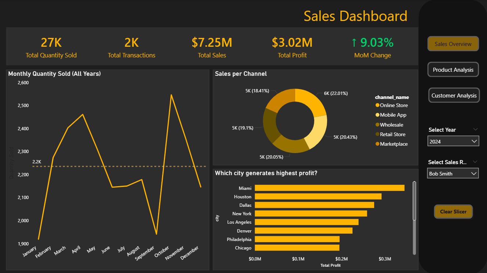
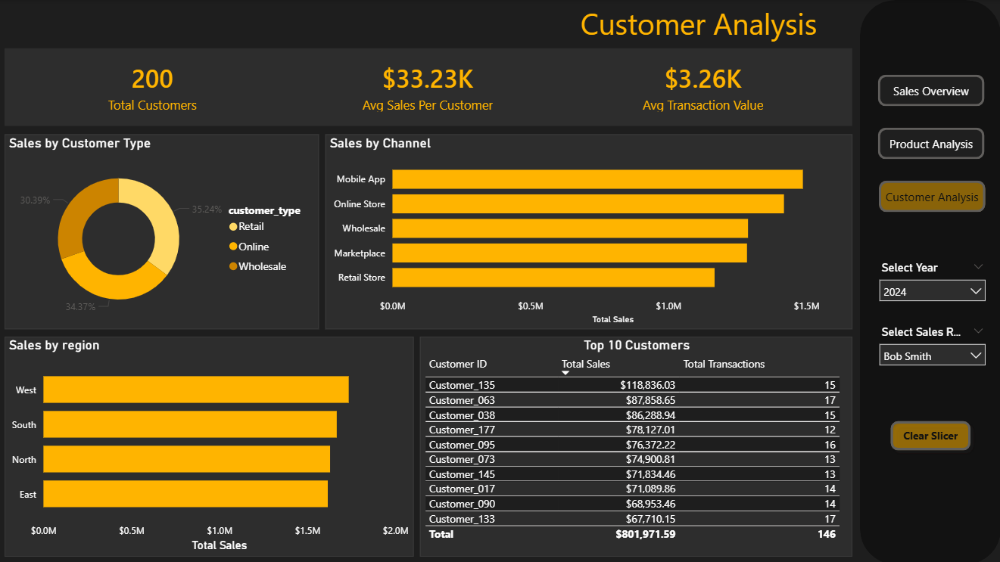
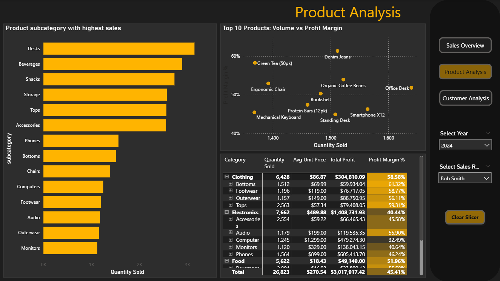

# Sales Performance Dashboard



## Overview

A comprehensive Power BI dashboard that analyzes sales performance across multiple dimensions including products, customers, channels, and regions. Built using a star schema data model with fact and dimension tables to provide actionable insights into revenue drivers, profitability, and customer behavior.

## Problem Statement

Business leaders need answers to critical questions: "Which products drive the most profit?", "Who are our best customers?", and "How is performance trending over time?" This dashboard answers these questions by analyzing sales data across 5 years to reveal patterns in profitability, customer segments, and regional performance.

## Data Source

- **Dataset:** Synthetic Sales Data (Star Schema)
- **Structure:** Relational database with 6 tables
  - `fact_sales` - Main transaction data (100,000 records)
  - `dim_date` - Date dimension (1,825 records - 5 years)
  - `dim_product` - Product information (20 products)
  - `dim_customer` - Customer details (200 customers)
  - `dim_sales_rep` - Sales representative data (10 reps)
  - `dim_channel` - Sales channel information (5 channels)
- **Time Period:** 2020 - 2024

## Skills Showcased

### Data Modeling
- **Star Schema Design:** Central fact table connected to multiple dimension tables
- **Table Relationships:** Established proper one-to-many relationships between dimensions and fact table
- **Data Transformation:**
  - Created date hierarchies (Year → Quarter → Month)
  - Calculated profit margins and adjusted salary columns
  - Handled null values in salary fields

### DAX Measures
- **Core Metrics:** Total Sales, Total Profit, Total Quantity, Total Transactions
- **Customer Analytics:** Total Customers, Avg Sales Per Customer, Avg Transaction Value
- **Time Intelligence:** Month-over-Month Change with dynamic indicators
- **Profitability Analysis:** Profit Margin % with contextual calculations

### Interactive Design
- **Navigation Panel:** Custom buttons for seamless page switching
- **Synchronized Slicers:** Year and Sales Rep filters applied across all pages
- **Dynamic Formatting:** Conditional colors for profit margins and MoM indicators
- **Clear Slicer Button:** Reset all selections instantly

### Visual Design
- **Dark Mode Theme:** Professional executive aesthetic (#1E1E1E, #2D2D2D)
- **Gold Accent Color:** Consistent highlighting (#FFB400)
- **Conditional Formatting:** Gradient scales on profit margins
- **Consistent Typography:** White text on dark backgrounds for readability

## Dashboard Pages

### Page 1: Sales Dashboard Overview


**KPI Cards:**
- Total Quantity Sold (27K for 2024)
- Total Transactions (2K)
- Total Sales ($7.25M)
- Total Profit ($3.02M)
- MoM Change (↑ 9.03% - green indicator)

**Visualizations:**
- **Monthly Quantity Sold:** Line chart with average benchmark line showing seasonal patterns
- **Sales per Channel:** Donut chart revealing even distribution (~20% each channel)
- **Profit by City:** Bar chart identifying top-performing cities (Miami, Houston, Dallas lead)

---

### Page 2: Product Analysis


**Visualizations:**
- **Profit by Subcategory:** Bar chart showing Desks and Phones as top profit drivers
- **Volume vs Profit Margin:** Scatter plot identifying star products (high volume + high margin)
- **Category Matrix:** Detailed breakdown with conditional formatting on Profit Margin %

**Key Insights:**
- Clothing has highest margins (58.58%) but lower volume
- Electronics has highest revenue but lowest margins (40.44%)
- Cotton T-Shirt and Denim Jeans are star products (top-right quadrant)

---

### Page 3: Customer Analysis


**KPI Cards:**
- Total Customers (200)
- Avg Sales Per Customer ($33.23K)
- Avg Transaction Value ($3.26K)

**Visualizations:**
- **Sales by Customer Type:** Donut chart showing Online (35.24%), Retail (34.37%), Wholesale (30.39%)
- **Sales by Channel:** Bar chart with Mobile App and Online Store leading
- **Sales by Region:** Bar chart revealing West and South as top regions
- **Top 10 Customers:** Table ranked by Total Sales with transaction counts

## Technical Implementation

### Power Query Transformations
```
1. Imported star schema CSV files from local directory
2. Established relationships between fact and dimension tables
3. Created date hierarchy for time-based analysis
4. Combined salary columns (yearly and hourly adjusted)
5. Cleaned and standardized text fields
```

### Key DAX Measures Created

**Core Metrics:**
```dax
Total Sales = SUM(sales_fact[net_amount])

Total Profit = SUM(sales_fact[profit])

Total Quantity = SUM(sales_fact[quantity])

Total Transactions = COUNTROWS(sales_fact)

Profit Margin % = DIVIDE(SUM(sales_fact[profit]), SUM(sales_fact[net_amount]))
```

**Customer Analytics:**
```dax
Total Customers = DISTINCTCOUNT(sales_fact[customer_id])

Avg Sales Per Customer = DIVIDE([Total Sales], [Total Customers])

Avg Transaction Value = DIVIDE([Total Sales], COUNTROWS(sales_fact))
```

**Time Intelligence:**
```dax
MoM Change Value = 
VAR CurrentSales = [Total Sales]
VAR PreviousSales = CALCULATE([Total Sales], DATEADD(date_dim[date], -1, MONTH))
RETURN
DIVIDE(CurrentSales - PreviousSales, PreviousSales)

MoM Change Display = 
VAR CurrentSales = [Total Sales]
VAR PreviousSales = CALCULATE([Total Sales], DATEADD(date_dim[date], -1, MONTH))
VAR Change = DIVIDE(CurrentSales - PreviousSales, PreviousSales)
RETURN
IF(Change >= 0, "↑ " & FORMAT(Change, "0.00%"), "↓ " & FORMAT(Change, "0.00%"))
```

## Key Insights

1. **Profitability Paradox:**
   - Electronics generates highest revenue ($1.4M in 2024) but has lowest margins (40%)
   - Clothing has best margins (58%) but lower volume
   - **Recommendation:** Focus on increasing Clothing sales volume while optimizing Electronics costs

2. **Channel Distribution:**
   - All 5 channels perform similarly (~20% each)
   - No single channel dominance indicates healthy diversification
   - Mobile App slightly leads, suggesting digital investment is paying off

3. **Regional Performance:**
   - West and South regions outperform North and East
   - **Opportunity:** Investigate underperformance in East region

4. **Customer Concentration:**
   - Top 10 customers represent significant revenue
   - Customer_135 leads with $118K in sales
   - **Risk:** Monitor customer concentration for revenue stability

5. **Seasonal Patterns:**
   - February and September show consistent dips
   - November shows strong performance (holiday prep)
   - **Action:** Plan promotions for slow months

## What I Learned

### Technical Growth
- Building comprehensive star schema data models
- Creating dynamic navigation panels with button actions
- Implementing conditional formatting with DAX-based rules
- Designing cohesive dark mode themes with consistent color palettes
- Synchronizing slicers across multiple pages

### Analytical Thinking
- Balancing multiple KPIs to tell a complete story
- Understanding the relationship between volume and profitability
- Identifying actionable insights from visual patterns
- Structuring dashboards for different user personas (executive vs analyst views)

### Design Principles
- Importance of visual hierarchy in dashboard layout
- How color psychology affects data interpretation
- Creating professional aesthetics that enhance rather than distract
- Building intuitive navigation for multi-page reports

## Dashboard Screenshots

### Sales Overview - Filtered by 2024, Bob Smith

*Showing 2024 performance for Sales Rep Bob Smith - 9.03% MoM growth*

### Product Analysis - Category Deep Dive

*Matrix showing profit margins by category with conditional formatting*

### Customer Analysis - Regional Breakdown

*West region leads with highest sales, balanced customer type distribution*

## Connect With Me

- **LinkedIn:** [https://www.linkedin.com/in/ifeoluwa-orelaja]
- **GitHub:** github.com/Lamppost-ux
- **Email:** orelaja2@gmail.com

---

*This project demonstrates intermediate Power BI capabilities including star schema data modeling, advanced DAX measures, custom theme design, and multi-page interactive navigation. Built as part of my data analytics portfolio.*